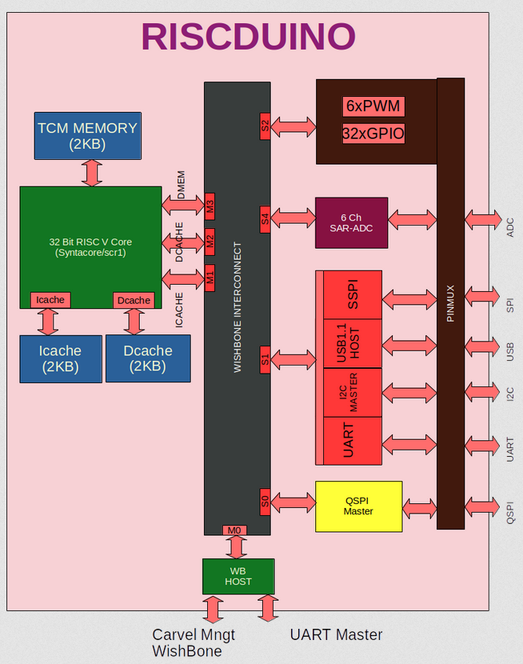

.. raw:: html

   <!---
   # SPDX-FileCopyrightText: 2021 Dinesh Annayya (dinesha@opencores.org)
   #
   # Licensed under the Apache License, Version 2.0 (the "License");
   # you may not use this file except in compliance with the License.
   # You may obtain a copy of the License at
   #
   #      http://www.apache.org/licenses/LICENSE-2.0
   #
   # Unless required by applicable law or agreed to in writing, software
   # distributed under the License is distributed on an "AS IS" BASIS,
   # WITHOUT WARRANTIES OR CONDITIONS OF ANY KIND, either express or implied.
   # See the License for the specific language governing permissions and
   # limitations under the License.
   #
   # SPDX-License-Identifier: Apache-2.0
   -->

Description
===========

This section provides basic description of the Riscduino SoC.

Block Diagram
--------------

     Riscduino block diagram

Key features
------------
    * Open sourced under Apache-2.0 License (see LICENSE file) - unrestricted commercial use allowed.
    * 32 Bit RISC-V core
    * 2KB SRAM for instruction cache 
    * 2KB SRAM for data cache
    * 2KB SRAM for Tightly coupled memory - For Data Memory
    * Quad SPI Master
    * UART with 16Byte FIFO
    * USB 1.1 Host
    * I2C Master
    * UART Master
    * Simple SPI Master
    * 6 Channel ADC (in Progress)
    * 6 PWM
    * Pin Compatbible to arudino uno
    * Wishbone compatible design
    * Written in System Verilog
    * Open-source tool set
       * simulation - iverilog
       * synthesis  - yosys
       * backend/sta - openlane tool set
    * Verification suite provided.

License
-------

The Riscduino is an open-source design, licensed under the terms of Apache 2.0.

Repository
----------

The complete chip design may be obtained from the git repository located at GitHub `Riscdino database <https://github.com/dineshannayya/riscduino/>`

Process
-------

The Riscduino chip is tagetted to part of efabless MPW Shuttle and in SkyWater 0.13um CMOS technology, with process specifications and data at GitHub `google/skywater-pdk repository <https://github.com/google/skywater-pdk>`_.
