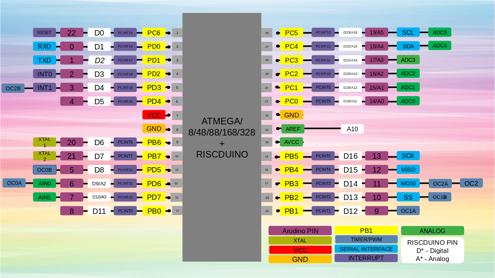

.. raw:: html
   <!---
   # SPDX-FileCopyrightText: 2021 Dinesh Annayya (dinesha@opencores.org)
   #
   # Licensed under the Apache License, Version 2.0 (the "License");
   # you may not use this file except in compliance with the License.
   # You may obtain a copy of the License at
   #
   #      http://www.apache.org/licenses/LICENSE-2.0
   #
   # Unless required by applicable law or agreed to in writing, software
   # distributed under the License is distributed on an "AS IS" BASIS,
   # WITHOUT WARRANTIES OR CONDITIONS OF ANY KIND, either express or implied.
   # See the License for the specific language governing permissions and
   # limitations under the License.
   #
   # SPDX-License-Identifier: Apache-2.0
   -->

Pinout description
==================

This section describes lists the pinout for the SoC, and provides the description for pins.

 Pinout Diagram
-------------------

 Pinout Map
-------------------

.. list-table:: Pinout
    :name: pinout
    :header-rows: 1
    :stub-columns: 1

    * - ATMGA328 Pin No
      - Functionality
      - Arudino Pin Name
      - Carvel Pin Mapping
    * - 1 
      - :ref:`PC6/RESET <mprj_io>` 
      - 
      - :ref:`mprj_io[0] <mprj_io>`
    * - 2 
      - :ref:`PD0/RXD <mprj_io>` 
      - :ref:`D0 <arduino_io>` 
      - :ref:`mprj_io[1] <mprj_io>`
    * - 3 
      - :ref:`PD1/TXD <mprj_io>` 
      - :ref:`D1 <arduino_io>` 
      - :ref:`mprj_io[2] <mprj_io>`
    * - 4 
      - :ref:`PD2/INT0 <mprj_io>` 
      - :ref:`D2 <arduino_io>` 
      - :ref:`mprj_io[3] <mprj_io>`
    * - 5 
      - :ref:`PD3/INT1/OC2B(PWM0) <mprj_io>` 
      - :ref:`D3 <arduino_io>` 
      - :ref:`mprj_io[4] <mprj_io>`
    * - 6 
      - :ref:`PD4 <mprj_io>` 
      - :ref:`D4 <arduino_io>` 
      - :ref:`mprj_io[5] <mprj_io>`
    * - 7 
      - :ref:`VCC <mprj_io>` 
      - 
      - 
    * - 8 
      - :ref:`GND <mprj_io>` 
      - 
      - 
    * - 9 
      - :ref:`PB6/XTAL1/TOSC1 <mprj_io>` 
      - 
      - :ref:`mprj_io[6] <mprj_io>`
    * - 10 
      - :ref:`PB7/XTAL2/TOSC2 <mprj_io>` 
      - 
      - :ref:`mprj_io[7] <mprj_io>`
    * - 11 
      - :ref:`PD5/OC0B(PWM1)/T1 <mprj_io>` 
      - :ref:`D5 <arduino_io>` 
      - :ref:`mprj_io[8] <mprj_io>`
    * - 12 
      - :ref:`PD6/OC0A(PWM2)/AIN0 <mprj_io>` 
      - :ref:`D6 <arduino_io>` 
      - :ref:`mprj_io[9]/analog_io[2] <mprj_io>`
    * - 13 
      - :ref:`PD7/A1N1 <mprj_io>` 
      - :ref:`D7 <arduino_io>` 
      - :ref:`mprj_io[10]/analog_io[3] <mprj_io>`
    * - 14 
      - :ref:`PB0/CLKO/ICP1 <mprj_io>` 
      - :ref:`D8 <arduino_io>` 
      - :ref:`mprj_io[11] <mprj_io>`
    * - 15 
      - :ref:`PB1/OC1A(PWM3) <mprj_io>` 
      - :ref:`D9 <arduino_io>` 
      - :ref:`mprj_io[12] <mprj_io>`
    * - 16 
      - :ref:`PB2/SS/OC1B(PWM4) <mprj_io>` 
      - :ref:`D10 <arduino_io>` 
      - :ref:`mprj_io[13] <mprj_io>`
    * - 17 
      - :ref:`PB3/MOSI/OC2A(PWM5) <mprj_io>` 
      - :ref:`D11 <arduino_io>` 
      - :ref:`mprj_io[14] <mprj_io>`
    * - 18 
      - :ref:`PB4/MISO <mprj_io>` 
      - :ref:`D12 <arduino_io>` 
      - :ref:`mprj_io[15] <mprj_io>`
    * - 19 
      - :ref:`PB5/SCK <mprj_io>` 
      - :ref:`D13 <arduino_io>` 
      - :ref:`mprj_io[16] <mprj_io>`
    * - 20 
      - :ref:`AVCC <mprj_io>` 
      - 
      - 
    * - 21 
      - :ref:`AREF <mprj_io>` 
      - 
      - :ref:`analog_io[10] <mprj_io>`
    * - 22 
      - :ref:`GND <mprj_io>` 
      - 
      - 
    * - 23 
      - :ref:`PC0/ADC0 <mprj_io>` 
      - :ref:`A0 <arduino_io>` 
      - :ref:`mprj_io[18]/analog_io[11] <mprj_io>`
    * - 24 
      - :ref:`PC1/ADC1 <mprj_io>` 
      - :ref:`A1 <arduino_io>` 
      - :ref:`mprj_io[19] <mprj_io>`
    * - 25 
      - :ref:`PC2/ADC2 <mprj_io>` 
      - :ref:`A2 <arduino_io>` 
      - :ref:`mprj_io[20] <mprj_io>`
    * - 26 
      - :ref:`PC3/ADC3 <mprj_io>` 
      - :ref:`A3 <arduino_io>` 
      - :ref:`mprj_io[21] <mprj_io>`
    * - 27 
      - :ref:`PC4/ADC4/SDA <mprj_io>` 
      - :ref:`A4 <arduino_io>` 
      - :ref:`mprj_io[22] <mprj_io>`
    * - 28 
      - :ref:`PC5/ADC5/SCL <mprj_io>` 
      - :ref:`A5 <arduino_io>` 
      - :ref:`mprj_io[23] <mprj_io>`
    * - Sflash 
      - :ref:`sflash_sck <mprj_io>` 
      - 
      - :ref:`mprj_io[24] <mprj_io>`
    * - Sflash 
      - :ref:`sflash_ss[0] <mprj_io>` 
      - 
      - :ref:`mprj_io[25] <mprj_io>`
    * - Sflash 
      - :ref:`sflash_ss[1] <mprj_io>` 
      - 
      - :ref:`mprj_io[26] <mprj_io>`
    * - Sflash 
      - :ref:`sflash_ss[2] <mprj_io>` 
      - 
      - :ref:`mprj_io[27] <mprj_io>`
    * - Sflash 
      - :ref:`sflash_ss[3] <mprj_io>` 
      - 
      - :ref:`mprj_io[28] <mprj_io>`
    * - Sflash 
      - :ref:`sflash_io[0] <mprj_io>` 
      - 
      - :ref:`mprj_io[29] <mprj_io>`
    * - Sflash 
      - :ref:`sflash_io[1] <mprj_io>` 
      - 
      - :ref:`mprj_io[30] <mprj_io>`
    * - Sflash 
      - :ref:`sflash_io[2] <mprj_io>` 
      - 
      - :ref:`mprj_io[31] <mprj_io>`
    * - Sflash 
      - :ref:`sflash_io[3] <mprj_io>` 
      - 
      - :ref:`mprj_io[32] <mprj_io>`
    * -  
      -  
      - 
      - 
    * - UARTM 
      - :ref:`uartm_rxd <mprj_io>` 
      - 
      - :ref:`mprj_io[34] <mprj_io>`
    * - UARTM 
      - :ref:`uartm_txd <mprj_io>` 
      - 
      - :ref:`mprj_io[35] <mprj_io>`
    * - USB HOST 
      - :ref:`usb_dp <mprj_io>` 
      - 
      - :ref:`mprj_io[36] <mprj_io>`
    * - USB HOST 
      - :ref:`usb_dn <mprj_io>` 
      - 
      - :ref:`mprj_io[37] <mprj_io>`

