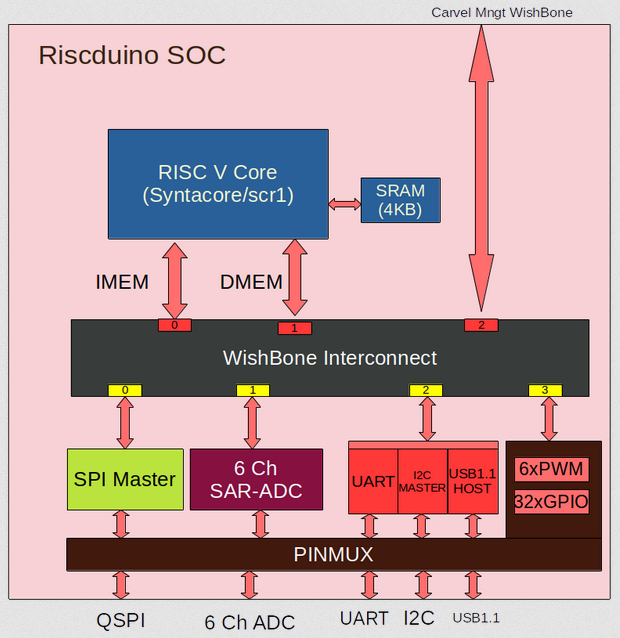

.. raw:: html
   <!---
   # SPDX-FileCopyrightText: 2021 Dinesh Annayya (dinesha@opencores.org)
   #
   # Licensed under the Apache License, Version 2.0 (the "License");
   # you may not use this file except in compliance with the License.
   # You may obtain a copy of the License at
   #
   #      http://www.apache.org/licenses/LICENSE-2.0
   #
   # Unless required by applicable law or agreed to in writing, software
   # distributed under the License is distributed on an "AS IS" BASIS,
   # WITHOUT WARRANTIES OR CONDITIONS OF ANY KIND, either express or implied.
   # See the License for the specific language governing permissions and
   # limitations under the License.
   #
   # SPDX-License-Identifier: Apache-2.0
   -->

RISCV
=====

Riscduino SOC Integrated 32 Bits RISC V core. Initial version of Single core RISC-V core is picked from 
Syntacore SCR1 (https://github.com/syntacore/scr1)

core customization
--------
Following Design changes are done on the basic version of syntacore RISC core
   * Some of the sv syntex are changed to standard verilog format to make compatibile with opensource tool iverilog & yosys
   * Instruction Request are changed from Single word to 4 Word Burst
   * Multiplication and Divsion are changed to improve timing
   * Additional pipe line stages added to improve the RISC timing closure near to 50Mhz
   * 2KB instruction cache 
   * 2KB data cache
   * Additional router are added towards instruction cache
   * Additional router are added towards data cache
   * Modified AXI/AHB interface to wishbone interface for instruction and data memory interface

Features
--------

   * RV32I or RV32E ISA base + optional RVM and RVC standard extensions
   * Machine privilege mode only
   * 2 to 5 stage pipeline
   * 2KB icache
   * 2KB dcache
   * Optional Integrated Programmable Interrupt Controller with 16 IRQ lines
   * Optional RISC-V Debug subsystem with JTAG interface
   * Optional on-chip Tightly-Coupled Memory

Block Diagram
--------------

     Riscduino Single Core

     Riscduino Single Core with cache

     Riscduino Two Core with cache
